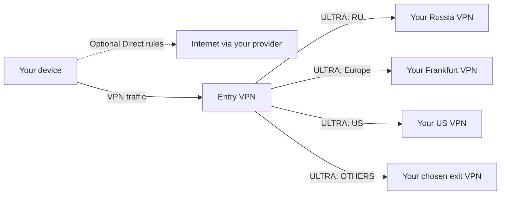

<p align="center">
  
</p>

<p align="center">
  <a href="https://meduzavpn.com"></a>
  <a href="https://github.com/txrx13/meduzavpn/releases/latest"></a>
  <a href="#downloads"></a>
  
</p>

<h3 align="center">One account. Your devices. A choice of VPN protocols.</h3>

<p align="center">
  Official MeduzaVPN applications and command-line tools.<br>
  Choose a VPN location and protocol, manage your services, and connect from your devices.
</p>

<p align="center">
  <b>This repository distributes compiled releases and documentation.</b><br>
  <sub>The application source code is maintained separately and is not published here.</sub>
</p>

---

## What is new

**[1.2.26 (188)](https://github.com/txrx13/meduzavpn/releases/tag/v1.2.26-188)** brings notifications sent from the server, so a service ending, a suspended service, an unfinished order or an unstarted trial reaches you even if the app has not been opened in a while. MeduzaVPN ULTRA now runs as a real packet engine in the Windows app. A trial can be turned into a one-time purchase instead of a subscription.

| Release | Highlights |
|---|---|
| **[188 — Notifications from the server, ULTRA on Windows](https://github.com/txrx13/meduzavpn/releases/tag/v1.2.26-188)** | Reminders about services, orders, trials and one-time purchases are sent by the server, in your quiet hours and time zone, once each, and only for the reminders you left switched on. MeduzaVPN ULTRA works as a packet engine in the Windows app. A one-time purchase is offered next to the subscription. The connect button is legible in daylight and no longer spins forever after a network change. |
| **[185 — Every protocol connects](https://github.com/txrx13/meduzavpn/releases/tag/v1.2.25-185)** | Linux: ULTRA, MeduzaVPN, WireGuard, OpenVPN, Xray and V2Ray all connect, where six of thirteen failed before — pinned ULTRA signing keys, AmneziaWG 3 profile fields, the WireGuard handshake check, tunnel addressing and self-signed exit certificates. The Linux desktop app connects the ULTRA it offers. Android builds Hysteria 2 for 32-bit ARM. |
| **[180 — Recent VPNs and DNS reliability](https://github.com/txrx13/meduzavpn/releases/tag/v1.2.24-180)** | Recently connected locations appear first. Selection alone and failed connections do not update history. ULTRA DNS uses pipelined TCP requests, full TCP replies and bounded resource cleanup. |
| **[178 — Backup API and safer recovery](https://github.com/txrx13/meduzavpn/releases/tag/v1.2.24-178)** | The app and CLI select a backup API if the primary is unavailable. Read requests can recover without automatically repeating payments, orders or settings changes. Updated domain routing and ULTRA networking. |
| **[175 — ULTRA by default and a choice at checkout](https://github.com/txrx13/meduzavpn/releases/tag/v1.2.24-175)** | New VPNs prefer ULTRA; saved manual protocol choices remain. Google Play checkout keeps both trial and paid base-plan offers. Updated app, CLI packages and screenshots. |
| **[173 — Edit presets and keep your location](https://github.com/txrx13/meduzavpn/releases/tag/v1.2.24-173)** | Edit preset names, networks and domains without rebuilding routes. Saving routing settings reconnects an affected active VPN and preserves the selected location. Updated macOS TestFlight packaging and shared data access for VPN extensions. |
| **[172 — Location Split tunneling](https://github.com/txrx13/meduzavpn/releases/tag/v1.2.24-172)** | One entry VPN, country and region presets, custom networks and domains, VPN/Direct destinations and an OTHERS fallback. ULTRA tunnels between your servers. Improved Devices spacing and Linux GUI runtime dependencies. |

**Release channels:** direct app and CLI downloads, the Windows installer and the signed apt/dnf repositories are build 188. Google Play carries 1.2.26 (188) on the production track. iOS and macOS have 1.2.26 (188) in TestFlight; the Apple public listings still show 1.2.25 until a new version is submitted and reviewed. Version numbering skips 186 and 187: App Store Connect closes a version's train once that version goes on sale, so the release is 1.2.26 on every platform rather than letting the stores fall behind the site.

## Split tunneling, per location

Connect to one entry location and choose where different traffic goes. Split tunneling is configured in **each location's settings**, rather than in the global Settings menu. One location is selected as the entry VPN; its badge identifies it in the VPN list.

- **Country and territory presets:** IPv4/IPv6 network-prefix lists, including Russia, the United States, China and individual European countries.
- **Region presets:** Europe, Americas, Asia, Africa and Oceania combine country presets.
- **Custom presets:** create a named collection of CIDR networks and/or domains. In 173, edit its name and contents while keeping its existing route assignments. Saved presets without a route can also be edited from the Custom presets list.
- **Choose a destination:** send each preset through one of the VPN servers on your account, or select **Direct** to bypass the VPN.
- **OTHERS:** choose a destination for everything that did not match an earlier rule.
- **Ordered rules:** rules are evaluated from top to bottom; the first match wins. Put specific rules before broader regions. Europe includes Russia, so a separate RU rule belongs above Europe.

### Example policy

| Traffic preset | Destination |
|---|---|
| RU | Your Russia VPN |
| Europe | Your Frankfurt VPN |
| US | Your US VPN |
| OTHERS | Another selected VPN, or one of the same exit servers |

With Novosibirsk selected as the entry, this traffic enters through Novosibirsk, where routing sends it to the selected exit. If you configure Direct rules instead, their matching traffic bypasses the VPN on the client. The entry VPS establishes **ULTRA-only tunnels** to the configured exit servers.



### Set it up

1. Open a location's settings and turn on **Split tunneling**.
2. Select the entry VPN, add country/region presets or create a Custom preset, and assign a destination to each rule.
3. Arrange the rules and choose the **OTHERS** destination, then save.
4. Connect to the entry location. In 173, updating routing for an affected active connection automatically reconnects it using fresh settings and keeps the selected location. A failed reconnect shows an error; an already disconnected VPN stays disconnected.
5. To disable the feature, select **Off · no entry VPN**.

Large Apple-client policies containing Direct rules can exceed the OS VPN configuration size limit. Keep such policies small; the country-to-VPN example above keeps prefix routing on the entry VPS.

Country presets describe network registrations, which can differ from a website's physical location. Connecting to a Split tunneling entry uses ULTRA; graphical ULTRA connections are supported on **iOS, Android, macOS and Windows**, and on Linux through the `meduzavpnd` service. See [Protocols](#protocols) for the details.

## More in the app

| Feature | What you can do |
|---|---|
| **Subscription choice** | Start a free trial when eligible or choose **Pay now** to begin a paid subscription immediately. |
| **Devices** | See where your account is signed in, identify the current device, inspect IP and activity details, and sign out another device or all other devices. |
| **Connect On Demand** | Keep the VPN connected and reconnect automatically where supported. On Android, system-level blocking of connections without VPN is configured in Android's VPN settings. |
| **Ask Mia** | Use the in-app Meduza assistant for help. |
| **Notifications** | Since 188, reminders about services ending, suspended services, unfinished orders, unstarted trials and one-time purchases are sent from the server, so they arrive without opening the app. They follow your quiet hours and time zone, each reminder is sent once, and switching a reminder off in Settings stops it being sent at all. Signing out unregisters the device. iOS, Android and macOS. |
| **Location settings** | Manage supported IPv4/IPv6 options, share connection configurations as files or QR codes, and see when an IP address can next be changed. |
| **QR sign-in and desktop CLI** | Sign in to the command line with a QR code, list your VPNs, connect, check status and disconnect. On macOS/Windows the CLI controls the installed app. |
| **Backup API access** | Automatically use the backup API when the primary address is unavailable. Your session is retained. An uncertain payment or order is not automatically submitted a second time. |
| **ULTRA network recovery** | iOS and Android recover ULTRA when the physical network changes or returns after going offline. |

Feature availability depends on the platform, installed build, service configuration and account access.

### ULTRA validation

Earlier ULTRA releases were checked with repeated downloads, DNS requests under flow pressure, TCP/UDP tests and platform lifecycle tests. A controlled 200 Mbps fixture completed ten rounds at approximately 188–189 Mbps without HTTPS errors. This is a laboratory result, not a guarantee of a particular speed on a phone or mobile network. See the [170 release notes](https://github.com/txrx13/meduzavpn/releases/tag/v1.2.24-170) for that validation's scope and limitations.

## Protocols

MeduzaVPN clients offer protocols supported by the selected platform and service, including **MeduzaVPN**, **MeduzaVPN ULTRA**, **WireGuard**, **OpenVPN**, **VLESS**, **VLESS 2.0 (XHTTP + REALITY)**, **Hysteria 2**, **Xray/V2Ray**, **Shadowsocks**, **Outline**, **SOCKS5**, and **SoftEther**. System IKEv2/IPsec support depends on the operating system.

New VPN selections prefer **MeduzaVPN ULTRA** when the platform and service support it; an explicitly saved choice is preserved.

ULTRA's graphical client integration is available on **iOS, Android, macOS and, since 188, Windows** when enabled in the release. A build does not gain ULTRA merely by sharing the application version. The Linux desktop app offers ULTRA through the `meduzavpnd` service, which carries the engine and the pinned signing keys; it requires the corresponding release configuration and device enrollment. A CLI on macOS or Windows controls the installed application rather than supplying a separate VPN engine.

---

## Install on Linux

### Signed package repositories

**Repository snapshot checked 18 September 2026: 1.2.26-188.** The GUI is available for x86-64; the CLI and service are available for x86-64 and ARM64. Both apt/dnf repositories and [direct packages](#downloads) are current.

The apt/dnf repositories resolve dependencies and integrate with system updates. Their packages and metadata are signed. Install the signing key before adding a repository.

<details open>
<summary><b>Debian · Ubuntu</b></summary>

```bash
curl -fsSL https://meduzavpn-builds.fra1.digitaloceanspaces.com/repo/meduzavpn-archive-keyring.asc \
  | sudo gpg --dearmor -o /usr/share/keyrings/meduzavpn.gpg

echo "deb [signed-by=/usr/share/keyrings/meduzavpn.gpg] https://meduzavpn-builds.fra1.digitaloceanspaces.com/repo/deb stable main" \
  | sudo tee /etc/apt/sources.list.d/meduzavpn.list

sudo apt update
sudo apt install meduzavpn-desktop   # the app (GUI) — pulls in the service
sudo apt install meduzavpn           # a server: command line and service only
```
</details>

<details open>
<summary><b>Fedora · CentOS · RHEL</b></summary>

```bash
sudo rpm --import https://meduzavpn-builds.fra1.digitaloceanspaces.com/repo/meduzavpn-archive-keyring.asc

sudo tee /etc/yum.repos.d/meduzavpn.repo >/dev/null <<'REPO'
[meduzavpn]
name=MeduzaVPN
baseurl=https://meduzavpn-builds.fra1.digitaloceanspaces.com/repo/rpm
enabled=1
gpgcheck=1
repo_gpgcheck=1
gpgkey=https://meduzavpn-builds.fra1.digitaloceanspaces.com/repo/meduzavpn-archive-keyring.asc
REPO

sudo dnf install meduzavpn-desktop   # the app (GUI)
sudo dnf install meduzavpn           # command line and service only
```
</details>

<details>
<summary><b>Anything else</b> — Arch, openSUSE, NixOS, Alpine, a container</summary>

```bash
curl -fsSLO https://meduzavpn-builds.fra1.digitaloceanspaces.com/latest/meduzavpn-linux-amd64.tar.gz
mkdir meduzavpn-install
tar xzf meduzavpn-linux-amd64.tar.gz -C meduzavpn-install --strip-components=1
cd meduzavpn-install
sudo ./install.sh        # and ./uninstall.sh when you want it gone
```

The tarball carries compiled binaries, a systemd unit, an installer and an uninstaller — **not
source code**.
</details>

> [!NOTE]
> The service is never enabled for you. A VPN daemon that takes the default route a second
> after installation would be a rude surprise on a machine you reached over SSH.
> Start it when you are ready: `sudo systemctl enable --now meduzavpnd`

---

## <a id="downloads"></a>Downloads

Everything below is also on **[meduzavpn.com](https://meduzavpn.com)**.

**Release status, checked 18 September 2026:** direct downloads, the Windows installer and the signed Linux repositories serve 1.2.26 (188). Google Play 1.2.26 (188) is on the production track. iOS and macOS 1.2.26 (188) are in TestFlight for existing internal testers. Public Apple store releases are separate from TestFlight.

### Applications and testing

| Platform / channel | Current release | Download |
|---|---|---|
| iOS public store | 1.2.25 on sale; 1.2.26 (188) is in TestFlight | [App Store](https://apps.apple.com/us/app/meduzavpn/id6755959724) |
| macOS public store | 1.2.25 on sale; separate from the 1.2.26 DMG | [Mac App Store](https://apps.apple.com/app/meduzavpn/id6755959724) |
| iOS beta | 1.2.26 (188) | TestFlight; existing internal tester groups |
| macOS beta | 1.2.26 (188) | TestFlight; existing tester groups |
| Android public store | 1.2.26 (188), production track | [Google Play](https://play.google.com/store/apps/details?id=app.meduzavpn) |
| Android beta | 1.2.26 (188), internal testing | [Google Play testing](https://play.google.com/apps/testing/app.meduzavpn) |
| macOS direct installer | 1.2.26 (188) | [Signed, notarized DMG](https://meduzavpn.com/download/macos) |
| Android direct installer | 1.2.26 (188) | [Release-signed APK](https://meduzavpn.com/download/android) |
| Windows graphical app | 1.2.26 | [Windows installer](https://meduzavpn.com/download/windows) |
| Linux graphical app | 1.2.26-188, x86-64 | [DEB](https://meduzavpn.com/download/linux-desktop-deb) · [RPM](https://meduzavpn.com/download/linux-desktop-rpm) |

### Command line and Linux service

| Platform | Current release | Download |
|---|---|---|
| Linux CLI + daemon | 1.2.26-188 | [DEB](https://meduzavpn.com/download/linux-deb) · [RPM](https://meduzavpn.com/download/linux-rpm) · [tar.gz](https://meduzavpn.com/download/linux-tar) |
| macOS CLI | 1.2.26-188 | [Universal archive](https://meduzavpn.com/download/cli-macos) |
| Windows CLI | 1.2.26-188 | [Windows archive](https://meduzavpn.com/download/cli-windows) |

Versioned files and their SHA-256 checksums are listed in [GitHub Releases](https://github.com/txrx13/meduzavpn/releases). The website links above remain stable between releases. See each release's asset list for the architectures actually provided.

> [!IMPORTANT]
> Installing Linux files manually? The graphical `meduzavpn-desktop` package depends on the `meduzavpn` service package. Install both, or use the signed repository above to resolve dependencies.

---

## The command line

The same `meduzavpn` binary on all three desktop systems. One invocation brings up any VPN on
your account, with no configuration file needed:

```bash
meduzavpn login --qr                          # scan the code with the phone app
meduzavpn list                                # your VPNs, the protocols, the settings in force
meduzavpn connect --protocol vless2 --wait
meduzavpn status
meduzavpn disconnect
```

Every setting resolves **flag → environment → config file → what the server's profile says**,
`--json` works everywhere for scripts, and the exit codes tell *not signed in* apart from *no
daemon* from *the server refused*.

On Linux the tunnel belongs to the `meduzavpnd` service. On macOS and Windows it belongs to the
application, and the command line drives it over a local socket — turn the command-line
interface on in the app's settings first.

---

## Verifying what you downloaded

Each release has its own `SHA256SUMS` and detached signature, covering the twelve app and CLI files published to the website. The Windows installer is attached to the release as well, with its checksum printed in the release notes. Download the checksum file from the same release as your installer:

```bash
curl -fsSLO https://github.com/txrx13/meduzavpn/releases/download/v1.2.26-188/SHA256SUMS
sha256sum -c SHA256SUMS --ignore-missing
```

Packages in the repositories are covered by a signature chain rooted in our key, and each RPM
is signed individually as well:

```
MeduzaVPN Package Signing <packages@meduzavpn.com>
B53E 4BF4 D6EF A6F0 E2B7  EF7B 4843 39BB 9BE9 9052
```

---

<p align="center">
  <sub>
    MeduzaVPN is operated by IPFB LLC · <a href="https://meduzavpn.com">meduzavpn.com</a> ·
    <a href="https://meduzavpn.com/support">Support</a><br>
    This repository contains compiled builds only — no source code is published here.
  </sub>
</p>
