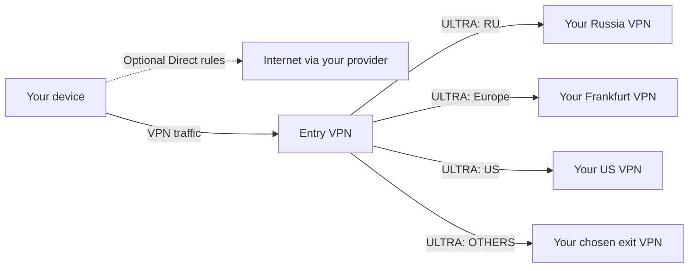

<p align="center">
  
</p>

<p align="center">
  <a href="https://meduzavpn.com"></a>
  <a href="#downloads"></a>
  <a href="#downloads"></a>
  
</p>

<h3 align="center">One account. Your devices. A choice of VPN protocols.</h3>

<p align="center">
  Official MeduzaVPN applications and command-line tools.<br>
  Choose a VPN location and protocol, manage your services, and connect from your devices.
</p>

<p align="center">
  <b>This repository distributes compiled releases and documentation.</b><br>
  <sub>The application source code is maintained separately and is not published here.</sub>
</p>

---

## Latest release: [MeduzaVPN 1.2.37 (231)](https://github.com/txrx13/meduzavpn/releases/tag/v1.2.37-231)

**Direct downloads and apt/dnf: 1.2.37 (231).** [Download applications and CLI](#downloads) · [Install from apt / dnf](#install-on-linux) · [Release notes and all 21 downloads](https://github.com/txrx13/meduzavpn/releases/tag/v1.2.37-231)

## What is new

**1.2.37 (231)** fixes macOS notification badges that could remain after notifications were read on another device. Opening the notification inbox refreshes its read state, and the Dock badge clears when nothing is unread. Enabling VPN on demand starts the connection promptly.

The release includes the latest renewal notification improvements and retains the VPN stability, carrier recovery and memory improvements from 1.2.36. Native VPN components are rebuilt from the release source for each platform.

Earlier releases:

| Release | Highlights |
|---|---|
| **[219 — notifications in the bell, one unread number, a steady launch screen](https://github.com/txrx13/meduzavpn/releases/tag/v1.2.34-219)** | Notifications the service sends now live in the app's bell as well as the operating system's, and the number on the icon, the number on the bell and the count inside it are one number, counted from the notices the app is holding — so a notice read on one device cannot leave a number on another device's icon with nothing unread to take it off. The launch logo no longer changes size between the system screen and the app's own. A tunnel that goes quiet is rebuilt rather than left looking connected; where a store will not take payment, the app takes it with every method the website has; television sign-in screens keep clear of the cut-off edge. |
| **[209 — a refused VPN configuration says so](https://github.com/txrx13/meduzavpn/releases/tag/v1.2.34-209)** | When the operating system refuses to save a VPN configuration — the alert that asks the customer to allow it was dismissed or declined — the app now names that instead of blaming the network, and the MeduzaVPN ULTRA bridge passes the system's own reason back rather than discarding it. A configuration write that lost a race against the app's kill-switch housekeeping is retried once. Version 1.2.34. |
| **[207 — when the store says no, sign-in language, e-mail already registered](https://github.com/txrx13/meduzavpn/releases/tag/v1.2.33-207)** | On the Play and App Store builds a refused purchase sheet now gets an explanation: payment through the store is not available in the region, the website takes the same account, these methods work there, one button to the sign-in form (only when the refusal is the store's doing); the server mails the same story once a week at most. Google and Apple sign-ins from the phone carry the phone's language, so letters and pushes stop defaulting to English. Signing up with a registered e-mail says so and offers to sign in. |
| **[204 — the week without payment in every app](https://github.com/txrx13/meduzavpn/releases/tag/v1.2.33-204)** | The offer Apple and Google customers already knew is now made from our own billing wherever there is no store: macOS from the site, the site APK, Windows, Linux and the account page on meduzavpn.com show one welcome window — the week, the price that follows, the exact first-charge date, one button that links a card, SBP or a Payssion mandate and starts the VPN at once. The day before the first charge a letter and a push explain the charge and how to cancel. Russian wording «без оплаты» throughout. Version 1.2.33. |
| **[203 — every payment method in the site APK, a free week on website subscriptions](https://github.com/txrx13/meduzavpn/releases/tag/v1.2.32-203)** | The Android build from meduzavpn.com pays like the macOS app: all methods on the order page with Google Pay as one tile where Play can charge, Russian methods first for Russian-language customers, and a plain message when Play closes its sheet without taking the payment. Website subscriptions start with seven free days: the card or mandate is linked at once, the first charge comes a week later, one trial per account. The Google Play build is unchanged. |
| **[202 — Android TV, sign-in confirmation, routers, a VPN list that stays put](https://github.com/txrx13/meduzavpn/releases/tag/v1.2.32-202)** | The Android app runs on televisions and set-top boxes, entirely from the remote: visible focus everywhere, the VPN list clear of the overscan area, a protocol picker that fits 720p and 1080p; ULTRA, MeduzaVPN and WireGuard connect and disconnect on a live service. A TV or a router shows a code and a QR; the phone app confirms the sign-in. The device list names devices instead of showing raw headers. OpenWrt packages (x86/64, Filogic, MT7621) with a LuCI page and static daemons for four processor families, ULTRA built in; two daemon fixes from the router laboratory (`--state-dir` reaches the engines; `/etc/resolv.conf` is rewritten in place under bind mounts). iOS and macOS request the APNs token from the AppDelegate; tapping a push or a reminder opens its text. The VPN list is on screen the moment the app opens, from a cache that now really persists, and it no longer jumps on a token refresh or a return to the app; the very first frame of the home screen is already the list, also for accounts with several VPNs. |
| **[191 — Referral programme, and screens that stop flickering](https://github.com/txrx13/meduzavpn/releases/tag/v1.2.28-191)** | Invite people with a link or a QR code and earn a share of every payment they make — the first one and every one after it, 5%, 10% or 15% depending on how many of your invitees have paid. Rewards wait out the refund window, then land on a balance you can spend on MeduzaVPN or withdraw. The list of invitees is anonymised. The invitation icon and the bell appear as soon as you sign in instead of after a restart; the server list stays on screen while it refreshes; the tariff, notification and subscription screens no longer slide under the title bar. |
| **[189 — Announcements, and the country your VPN is in](https://github.com/txrx13/meduzavpn/releases/tag/v1.2.26-189)** | Announcements arrive in the app: a bell with an unread badge, the list, the full text, and a popup for the ones that earn it. Each VPN is labelled with a flag, the country and the city in your language, not with the server's internal name. macOS, Windows and Linux show the launch logo rather than a black window. Re-opening the app no longer disconnects a working tunnel, and the retry the app makes after a network change is supervised. |
| **[188 — Notifications from the server, ULTRA on Windows](https://github.com/txrx13/meduzavpn/releases/tag/v1.2.26-188)** | Reminders about services, orders, trials and one-time purchases are sent by the server, in your quiet hours and time zone, once each, and only for the reminders you left switched on. MeduzaVPN ULTRA works as a packet engine in the Windows app. A one-time purchase is offered next to the subscription. The connect button is legible in daylight and no longer spins forever after a network change. |
| **[185 — Every protocol connects](https://github.com/txrx13/meduzavpn/releases/tag/v1.2.25-185)** | Linux: ULTRA, MeduzaVPN, WireGuard, OpenVPN, Xray and V2Ray all connect, where six of thirteen failed before — pinned ULTRA signing keys, AmneziaWG 3 profile fields, the WireGuard handshake check, tunnel addressing and self-signed exit certificates. The Linux desktop app connects the ULTRA it offers. Android builds Hysteria 2 for 32-bit ARM. |
| **[180 — Recent VPNs and DNS reliability](https://github.com/txrx13/meduzavpn/releases/tag/v1.2.24-180)** | Recently connected locations appear first. Selection alone and failed connections do not update history. ULTRA DNS uses pipelined TCP requests, full TCP replies and bounded resource cleanup. |
| **[178 — Backup API and safer recovery](https://github.com/txrx13/meduzavpn/releases/tag/v1.2.24-178)** | The app and CLI select a backup API if the primary is unavailable. Read requests can recover without automatically repeating payments, orders or settings changes. Updated domain routing and ULTRA networking. |
| **[175 — ULTRA by default and a choice at checkout](https://github.com/txrx13/meduzavpn/releases/tag/v1.2.24-175)** | New VPNs prefer ULTRA; saved manual protocol choices remain. Google Play checkout keeps both trial and paid base-plan offers. Updated app, CLI packages and screenshots. |
| **[173 — Edit presets and keep your location](https://github.com/txrx13/meduzavpn/releases/tag/v1.2.24-173)** | Edit preset names, networks and domains without rebuilding routes. Saving routing settings reconnects an affected active VPN and preserves the selected location. Updated macOS TestFlight packaging and shared data access for VPN extensions. |
| **[172 — Location Split tunneling](https://github.com/txrx13/meduzavpn/releases/tag/v1.2.24-172)** | One entry VPN, country and region presets, custom networks and domains, VPN/Direct destinations and an OTHERS fallback. ULTRA tunnels between your servers. Improved Devices spacing and Linux GUI runtime dependencies. |

**Release channels:** the current direct release is **1.2.37 (231)**. Download links below point to our website and DigitalOcean distribution. Store submissions and direct downloads have separate availability: Apple and Google listings update after their review. See [release 231](releases/1.2.37-231.md) for the verified channel status, source revision and checksums. Older GitHub release assets are retained as historical releases; use the current download links below.

## Split tunneling, per location

Connect to one entry location and choose where different traffic goes. Split tunneling is configured in **each location's settings**, rather than in the global Settings menu. One location is selected as the entry VPN; its badge identifies it in the VPN list.

- **Country and territory presets:** IPv4/IPv6 network-prefix lists, including Russia, the United States, China and individual European countries.
- **Region presets:** Europe, Americas, Asia, Africa and Oceania combine country presets.
- **Custom presets:** create a named collection of CIDR networks and/or domains. In 173, edit its name and contents while keeping its existing route assignments. Saved presets without a route can also be edited from the Custom presets list.
- **Choose a destination:** send each preset through one of the VPN servers on your account, or select **Direct** to bypass the VPN.
- **OTHERS:** choose a destination for everything that did not match an earlier rule.
- **Ordered rules:** rules are evaluated from top to bottom; the first match wins. Put specific rules before broader regions. Europe includes Russia, so a separate RU rule belongs above Europe.

### Example policy

| Traffic preset | Destination |
|---|---|
| RU | Your Russia VPN |
| Europe | Your Frankfurt VPN |
| US | Your US VPN |
| OTHERS | Another selected VPN, or one of the same exit servers |

With Novosibirsk selected as the entry, this traffic enters through Novosibirsk, where routing sends it to the selected exit. If you configure Direct rules instead, their matching traffic bypasses the VPN on the client. The entry VPS establishes **ULTRA-only tunnels** to the configured exit servers.



### Set it up

1. Open a location's settings and turn on **Split tunneling**.
2. Select the entry VPN, add country/region presets or create a Custom preset, and assign a destination to each rule.
3. Arrange the rules and choose the **OTHERS** destination, then save.
4. Connect to the entry location. In 173, updating routing for an affected active connection automatically reconnects it using fresh settings and keeps the selected location. A failed reconnect shows an error; an already disconnected VPN stays disconnected.
5. To disable the feature, select **Off · no entry VPN**.

Large Apple-client policies containing Direct rules can exceed the OS VPN configuration size limit. Keep such policies small; the country-to-VPN example above keeps prefix routing on the entry VPS.

Country presets describe network registrations, which can differ from a website's physical location. Connecting to a Split tunneling entry uses ULTRA; graphical ULTRA connections are supported on **iOS, Android, macOS and Windows**, and on Linux through the `meduzavpnd` service. See [Protocols](#protocols) for the details.

## More in the app

| Feature | What you can do |
|---|---|
| **Subscription choice** | Start a free trial when eligible or choose **Pay now** to begin a paid subscription immediately. |
| **Devices** | See where your account is signed in, identify the current device, inspect IP and activity details, and sign out another device or all other devices. |
| **Connect On Demand** | Keep the VPN connected and reconnect automatically where supported. On Android, system-level blocking of connections without VPN is configured in Android's VPN settings. |
| **Ask Mia** | Use the in-app Meduza assistant for help. |
| **Notifications** | Since 188, reminders about services ending, suspended services, unfinished orders, unstarted trials and one-time purchases are sent from the server, so they arrive without opening the app. They follow your quiet hours and time zone, each reminder is sent once, and switching a reminder off in Settings stops it being sent at all. Signing out unregisters the device. iOS, Android and macOS. |
| **Location settings** | Manage supported IPv4/IPv6 options, share connection configurations as files or QR codes, and see when an IP address can next be changed. |
| **QR sign-in and desktop CLI** | Sign in to the command line with a QR code, list your VPNs, connect, check status and disconnect. On macOS/Windows the CLI controls the installed app. |
| **Backup API access** | Automatically use the backup API when the primary address is unavailable. Your session is retained. An uncertain payment or order is not automatically submitted a second time. |
| **ULTRA network recovery** | iOS and Android recover ULTRA when the physical network changes or returns after going offline. |

Feature availability depends on the platform, installed build, service configuration and account access.

### ULTRA validation

Earlier ULTRA releases were checked with repeated downloads, DNS requests under flow pressure, TCP/UDP tests and platform lifecycle tests. A controlled 200 Mbps fixture completed ten rounds at approximately 188–189 Mbps without HTTPS errors. This is a laboratory result, not a guarantee of a particular speed on a phone or mobile network. See the [170 release notes](https://github.com/txrx13/meduzavpn/releases/tag/v1.2.24-170) for that validation's scope and limitations.

## <a id="routers"></a>Routers and televisions

A router with MeduzaVPN on it puts everything behind it into the tunnel — including televisions and set-top boxes that cannot run a VPN client of their own. The daemon is the same `meduzavpnd` that the Linux packages carry, with ULTRA built in and the production signing roots pinned.

### OpenWrt packages (24.10, `.ipk`)

| Target | Architecture | Download |
|---|---|---|
| x86/64 (a PC, a VM, a mini-PC router) | `x86_64` | [meduzavpn-x86-64.ipk](https://www.meduzavpn.com/download/openwrt-x86-64) |
| MediaTek Filogic (modern Wi-Fi 6 routers) | `aarch64_cortex-a53` | [meduzavpn-mediatek-filogic.ipk](https://www.meduzavpn.com/download/openwrt-filogic) |
| MT7621 (most inexpensive routers) | `mipsel_24kc` | [meduzavpn-ramips-mt7621.ipk](https://www.meduzavpn.com/download/openwrt-mt7621) |
| LuCI page, any target | `all` | [luci-app-meduzavpn.ipk](https://www.meduzavpn.com/download/openwrt-luci) |

```sh
scp meduzavpn-*.ipk luci-app-meduzavpn.ipk root@router:/tmp/
ssh root@router 'opkg update && opkg install /tmp/meduzavpn-*.ipk /tmp/luci-app-meduzavpn.ipk'
```

Then open **VPN → MeduzaVPN** in LuCI, scan the QR code with the phone app to sign in, pick a country and a protocol. Or from the shell: `meduzavpn login --qr`. Dependencies: `kmod-tun`, `ip-full`, `ca-bundle`; the LuCI page needs `luci-base`, `rpcd`, `ucode` and `uclient-fetch`.

> [!IMPORTANT]
> The package with ULTRA inside takes **40–46 MB installed**. It fits an x86 box, a router with extroot, USB or NAND storage — not a 16 MB flash. Routers without room for it can still run a static daemon from a USB stick or an extroot.

### Static daemons (any Linux router, no opkg needed)

| Processor | Download |
|---|---|
| arm64 (aarch64) | [meduzavpn-router-arm64.tar.gz](https://www.meduzavpn.com/download/router-arm64) |
| armv7 | [meduzavpn-router-arm.tar.gz](https://www.meduzavpn.com/download/router-arm) |
| mips (big-endian, softfloat) | [meduzavpn-router-mips.tar.gz](https://www.meduzavpn.com/download/router-mips) |
| mipsel (little-endian, softfloat) | [meduzavpn-router-mipsle.tar.gz](https://www.meduzavpn.com/download/router-mipsle) |

Each archive holds `meduzavpnd` (the daemon with every engine), `meduzavpn` (the command line) and `meduzavpnd-lite` (the same daemon without the ULTRA, Xray and Hysteria cores, for boards where 35 MB is too much — it says so when asked for those protocols). Checksums for all router files are in [`routers-SHA256SUMS`](https://meduzavpn-builds.fra1.digitaloceanspaces.com/latest/routers-SHA256SUMS).

### Televisions

| Device | How |
|---|---|
| Android TV, Google TV, Fire TV | The Android app, from [Google Play](https://play.google.com/store/apps/details?id=app.meduzavpn) or the [APK](https://meduzavpn.com/download/android). Every screen works with the remote; sign in with the on-screen keyboard or confirm from your phone. |
| Apple TV | The tvOS app is in TestFlight for the internal group (1.0.0, sign-in by code, ULTRA). Public release follows the beta. |
| Any television, via the router | Install MeduzaVPN on the router above; the television needs nothing. |

## Protocols

MeduzaVPN clients offer protocols supported by the selected platform and service, including **MeduzaVPN**, **MeduzaVPN ULTRA**, **WireGuard**, **OpenVPN**, **VLESS**, **VLESS 2.0 (XHTTP + REALITY)**, **Hysteria 2**, **Xray/V2Ray**, **Shadowsocks**, **Outline**, **SOCKS5**, and **SoftEther**. System IKEv2/IPsec support depends on the operating system.

New VPN selections prefer **MeduzaVPN ULTRA** when the platform and service support it; an explicitly saved choice is preserved.

ULTRA's graphical client integration is available on **iOS, Android, macOS and, since 188, Windows** when enabled in the release. A build does not gain ULTRA merely by sharing the application version. The Linux desktop app offers ULTRA through the `meduzavpnd` service, which carries the engine and the pinned signing keys; it requires the corresponding release configuration and device enrollment. A CLI on macOS or Windows controls the installed application rather than supplying a separate VPN engine.

---

## Install on Linux

### Install from our apt / dnf repository (recommended)

**Repository snapshot checked 23 September 2026: 1.2.37-231.** The GUI is available for x86-64; the CLI and service are available for x86-64 and ARM64. Both apt/dnf repositories and [direct packages](#downloads) are current.

The apt/dnf repositories resolve dependencies and integrate with system updates. Repository metadata is signed; RPM packages are also signed individually. Install the signing key before adding a repository.

<details open>
<summary><b>Debian · Ubuntu</b></summary>

```bash
curl -fsSL https://meduzavpn-builds.fra1.digitaloceanspaces.com/repo/meduzavpn-archive-keyring.asc \
  | sudo gpg --dearmor -o /usr/share/keyrings/meduzavpn.gpg

echo "deb [signed-by=/usr/share/keyrings/meduzavpn.gpg] https://meduzavpn-builds.fra1.digitaloceanspaces.com/repo/deb stable main" \
  | sudo tee /etc/apt/sources.list.d/meduzavpn.list

sudo apt update
sudo apt install meduzavpn-desktop   # the app (GUI) — pulls in the service
sudo apt install meduzavpn           # a server: command line and service only

# Already installed? Update the packages you use:
sudo apt install --only-upgrade meduzavpn-desktop meduzavpn  # GUI + service
# CLI/service only: sudo apt install --only-upgrade meduzavpn
```
</details>

<details open>
<summary><b>Fedora · CentOS · RHEL</b></summary>

```bash
sudo rpm --import https://meduzavpn-builds.fra1.digitaloceanspaces.com/repo/meduzavpn-archive-keyring.asc

sudo tee /etc/yum.repos.d/meduzavpn.repo >/dev/null <<'REPO'
[meduzavpn]
name=MeduzaVPN
baseurl=https://meduzavpn-builds.fra1.digitaloceanspaces.com/repo/rpm
enabled=1
gpgcheck=1
repo_gpgcheck=1
gpgkey=https://meduzavpn-builds.fra1.digitaloceanspaces.com/repo/meduzavpn-archive-keyring.asc
REPO

sudo dnf install meduzavpn-desktop   # the app (GUI)
sudo dnf install meduzavpn           # command line and service only

# Already installed? Update the packages you use:
sudo dnf upgrade --refresh meduzavpn-desktop meduzavpn      # GUI + service
# CLI/service only: sudo dnf upgrade --refresh meduzavpn
```
</details>

<details>
<summary><b>Anything else</b> — Arch, openSUSE, NixOS, Alpine, a container</summary>

```bash
curl -fsSLO https://meduzavpn-builds.fra1.digitaloceanspaces.com/latest/meduzavpn-linux-amd64.tar.gz
mkdir meduzavpn-install
tar xzf meduzavpn-linux-amd64.tar.gz -C meduzavpn-install --strip-components=1
cd meduzavpn-install
sudo ./install.sh        # and ./uninstall.sh when you want it gone
```

The tarball carries compiled binaries, a systemd unit, an installer and an uninstaller — **not
source code**.
</details>

> [!NOTE]
> The service is never enabled for you. A VPN daemon that takes the default route a second
> after installation would be a rude surprise on a machine you reached over SSH.
> Start it when you are ready: `sudo systemctl enable --now meduzavpnd`

---

## <a id="downloads"></a>Downloads

Everything below is also on **[meduzavpn.com](https://meduzavpn.com)**.

**Release status, 23 September 2026:** the new direct release is 1.2.37 (231). Apple TestFlight availability and App Store review are separate steps; the public store can continue to offer the previous approved version while Apple reviews the update. See [release details and checksums](releases/1.2.37-231.md).

### Applications and testing

| Platform / channel | Current release | Download |
|---|---|---|
| iOS public store | 1.2.36 on sale; 1.2.37 (231) submitted for review | [App Store](https://apps.apple.com/us/app/meduzavpn/id6755959724) |
| macOS public store | 1.2.36 on sale; 1.2.37 (231) submitted for review; separate from the DMG | [Mac App Store](https://apps.apple.com/app/meduzavpn/id6755959724) |
| iOS beta | 1.2.37 (231) | TestFlight; existing internal tester groups |
| macOS beta | 1.2.37 (231) | TestFlight; existing tester groups |
| Android public store | Not updated in this release; use the direct APK for 1.2.37 (231) | [Google Play](https://play.google.com/store/apps/details?id=app.meduzavpn) |
| Apple TV beta | 1.0.0 (231), sign-in by code, ULTRA | TestFlight; internal group; external beta review pending |
| macOS direct installer | 1.2.37 (231) | [Signed, notarized DMG](https://meduzavpn.com/download/macos) |
| Android direct installer | 1.2.37 (231); installs on Android TV and Fire TV as well | [Release-signed APK](https://meduzavpn.com/download/android) |
| Windows graphical app | 1.2.37 (231) | [Windows installer](https://meduzavpn.com/download/windows) |
| Linux graphical app | 1.2.37-231, x86-64 | [DEB](https://meduzavpn.com/download/linux-desktop-deb) · [RPM](https://meduzavpn.com/download/linux-desktop-rpm) |

### Command line and Linux service

| Platform | Current release | Download |
|---|---|---|
| Linux CLI + daemon | 1.2.37-231 | [DEB](https://meduzavpn.com/download/linux-deb) · [RPM](https://meduzavpn.com/download/linux-rpm) · [tar.gz](https://meduzavpn.com/download/linux-tar) |
| macOS CLI | 1.2.37-231 | [Universal archive](https://meduzavpn.com/download/cli-macos) |
| Windows CLI | 1.2.37-231 | [Windows archive](https://meduzavpn.com/download/cli-windows) |

Versioned files and their signed SHA-256 checksums are listed in the [release manifest](https://meduzavpn-builds.fra1.digitaloceanspaces.com/builds/1.2.37-231/release.json). Downloads are hosted in DigitalOcean Spaces. The website links above remain stable between releases. See each release's asset list for the architectures actually provided.

> [!IMPORTANT]
> Installing Linux files manually? The graphical `meduzavpn-desktop` package depends on the `meduzavpn` service package. Install both, or use the signed repository above to resolve dependencies.

---

## The command line

The same `meduzavpn` binary on all three desktop systems. One invocation brings up any VPN on
your account, with no configuration file needed:

```bash
meduzavpn login --qr                          # scan the code with the phone app
meduzavpn list                                # your VPNs, the protocols, the settings in force
meduzavpn connect --protocol vless2 --wait
meduzavpn status
meduzavpn disconnect
```

Every setting resolves **flag → environment → config file → what the server's profile says**,
`--json` works everywhere for scripts, and the exit codes tell *not signed in* apart from *no
daemon* from *the server refused*.

On Linux the tunnel belongs to the `meduzavpnd` service. On macOS and Windows it belongs to the
application, and the command line drives it over a local socket — turn the command-line
interface on in the app's settings first.

---

## Verifying what you downloaded

The [release manifest](https://meduzavpn-builds.fra1.digitaloceanspaces.com/builds/1.2.37-231/release.json) records each installer, CLI and router package with its source revision, size and SHA-256 digest. Verify the signed checksum file before checking a download:

```bash
curl -fsSL https://meduzavpn-builds.fra1.digitaloceanspaces.com/repo/meduzavpn-archive-keyring.asc | gpg --import
curl -fsSLO https://meduzavpn-builds.fra1.digitaloceanspaces.com/builds/1.2.37-231/SHA256SUMS
curl -fsSLO https://meduzavpn-builds.fra1.digitaloceanspaces.com/builds/1.2.37-231/SHA256SUMS.asc
gpg --verify SHA256SUMS.asc SHA256SUMS
sha256sum -c SHA256SUMS --ignore-missing
```

Packages in the repositories are covered by a signature chain rooted in our key, and each RPM
is signed individually as well:

```
MeduzaVPN Package Signing <packages@meduzavpn.com>
B53E 4BF4 D6EF A6F0 E2B7  EF7B 4843 39BB 9BE9 9052
```

---

<p align="center">
  <sub>
    MeduzaVPN is operated by IPFB LLC · <a href="https://meduzavpn.com">meduzavpn.com</a> ·
    <a href="https://meduzavpn.com/support">Support</a><br>
    This repository contains compiled builds only — no source code is published here.
  </sub>
</p>
